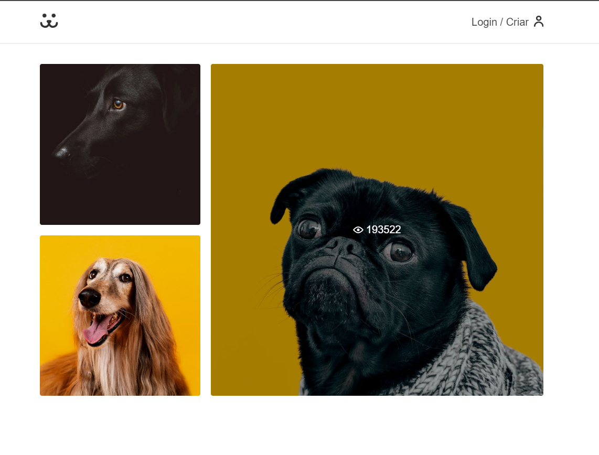
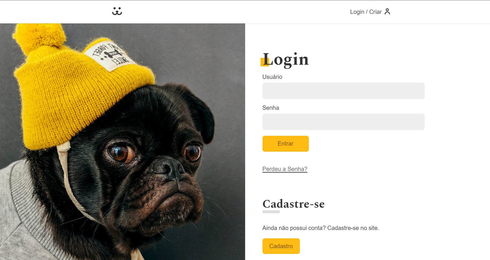

<h1 align="center">Instadogs</h1>

<p align="center">
  <a href="#-tecnologias">Tecnologias</a>&nbsp;&nbsp;&nbsp;|&nbsp;&nbsp;&nbsp;
  <a href="#-iniciando-a-aplicação">Iniciando</a>&nbsp;&nbsp;&nbsp;|&nbsp;&nbsp;&nbsp;
  <a href="#-projeto">Projeto</a>&nbsp;&nbsp;&nbsp;|&nbsp;&nbsp;&nbsp;
  <a href="#memo-licença">Licença</a>&nbsp;&nbsp;&nbsp;|&nbsp;&nbsp;&nbsp;
  <a href="#-contato">Contato</a>
</p>

<p align="center">
  
</p>

<br>

<p align="center">
  
</p>
<p align="center">
  
</p>

## 🚀 Tecnologias

Esse projeto foi desenvolvido com as seguintes tecnologias:

- **React**
- **React Router Dom**
- **React Redux**

## :car: Iniciando a aplicação

Baixe o repositório com git clone e entre na raiz para instalar as dependencias do projeto.<br/>

```bash
$ git clone https://github.com/MarlonChi/instadogs-redux
```

- Front-end

```bash
$ npm install
$ npm run dev
```

## 💻 Projeto

Rede social para donos de animais exibirem seu pets.

<br/>

## :memo: Licença

Esse projeto está sob a [licença MIT](LICENSE).

## :email: Contato

## E-mail: [**marlonchiodelli@hotmail.com**](mailto:marlonchiodelli@hotmail.com)
